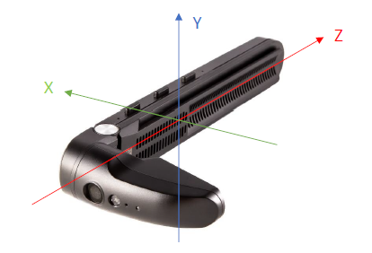

# Vuzix USB-C Viewer Android Support
## Overview
This SDK allows Android developers to integrate the Vuzix USB-C Viewers into an application running on an Android smart phone.

Please note that Vuzix smart glasses fall into two categories:
1. Stand-alone smart glasses, such as the M400, which are *not* supported by this SDK.
2. USB-C Viewers, such as the M400C, for which this SDK is intended.

The USB-C Viewer must be connected via a USB-C cable to an Android phone supporting USB-C DisplayPort Alt Mode.

## Supported Features
1. Display - The display is automatically detected by the phone. No SDK methods are required to support this.
2. Audio - The microphones and speaker are automatically detected by the phone. No SDK methods are required to support this.
3. Button input - The buttons are delivered to your application as
[Android Key Events](https://developer.android.com/reference/android/view/KeyEvent).
4. Touchpad input - The touchpad interaction is delivered to your application as
[Android Motion Events](https://developer.android.com/reference/android/view/MotionEvent).
5. Orientation Sensor - The SDK provides access to the proprietary data format of the USB-C Viewer orientation sensor in a
similar manner to [Android Sensor Events](https://developer.android.com/reference/android/hardware/SensorEvent).
6. Flashlight - The SDK provides the ability to turn the flashlight on the USB-C viewer on and off.
7. Camera - The USB-C Viewer camera acts as a standard UVC camera, and can be accessed using standard UVC camera APIs.

## Installation
Most developers should use the stable pre-built libraries to get the required SDK behavior. You may integrate the Vuzix USB-C
Viewer SDK into an Android development project by referencing the appropriate Maven artifacts.

For gradle projects, specify the repository in your root gradle:

```
allprojects {
  repositories {
	  ...
	  maven { url 'https://jitpack.io' }
  }
}
```

And add the dependency for the SDK to your project gradle, along with the listed Kotlin
dependencies if not already included:

```
dependencies {
  implementation 'com.vuzix:sdk-usbcviewer:1.0.1'
  implementation "androidx.core:core-ktx:1.7.0"
  implementation "org.jetbrains.kotlinx:kotlinx-coroutines-android:1.5.2"
}
```

For a full list of available SDK release tags, and syntax to add to non-gradle projects, please see our
[Jitpack Package Repository](https://jitpack.io/#com.vuzix/sdk-usbcviewer).

## Application Manifest
The *AndroidManifest.xml* file may require changes to interact with the USB-C Viewer.

### Feature Declaration
Ensure the following line is in your *AndroidManifest.xml* to declare that you use the USB feature for your app:

`<uses-feature android:name="android.hardware.usb.host" />`

### Automatically Launching Your Application

Optionally, you can add an `intent-filter` in your *AndroidManifest.xml* within an `activity` tag to automatically launch your app when the
USB-C Viewer is connected to the phone.

```xml
<activity>
    <intent-filter>
        <action android:name="android.hardware.usb.action.USB_DEVICE_ATTACHED" />
    </intent-filter>
    <meta-data android:name="android.hardware.usb.action.USB_DEVICE_ATTACHED"
        android:resource="@xml/device_filter" />
</activity>
```

## Usage

### Common
The SDK exposes functionality of the external hardware. There are multiple SDK interface classes to handle each set of related behaviors. These are
described in subsequent sections below. Before using the specific behavior of each interface class, you must explicitly grant USB permission to use the device. 

Since your application may be run without the device being attached, you may also start a listener to
detect device connection changes.  This will automatically detect if dynamic permissions are required
for the new device and prompt the user for those as well. You will receive a callback indicating when
the device is ready to use. 

First you will want to register a `ConnectionListener` to recieve callbacks when connection changes or permissions change. 
```
USBCDeviceManager.shared(context).registerDeviceMonitor(<ConnectionListener>)
```

Second you will want to check to make sure the interface you are using is available by calling: 
```
USBCDeviceManager.shared(context).deviceControlInterface != null
```
if the permissions are granted the inteface will be available and ready to use.  
If permissions have not yet been granted then this will prompt the user to grant the permissions to the M400C usb device associated with the interface.  
You can then listen for a call back in your `ConnectionListener.onPermissionsChanged`.

You may optionally query `isDeviceAvailable()` to test if a M400c device is connected to the phone. 


A sample of that flow, minus exception handling, might look like:

```
val manager = USBCDeviceManager.shared(this)
manager.registerDeviceMonitor(this)
if (manager.deviceControlInterface != null) { // if permissions haven't been granted yet, this will trigger them!
     // do something!           
}
// else listen for onPermissionChanged() callback of your ConnectionListener
```

### Device Control Interface
The main device control interface is `USBCDeviceManager.shared(context).deviceControlInterface`. This interface is used to control main aspects of
you device.  You can control things like:
*  Restore Defaults 
*  Brightness 
*  Force Left Eye 
*  Autorotation 
*  Change the button Key Codes on physical press
For instance to change the brightness of the device: `USBCDeviceManager.shared(context).deviceControlInterface?.setBrightness(190)`
or to change auto-rotate: `USBCDeviceManager.shared(context).deviceControlInterface?.setAutoRotation(true/false)`

### Camera Interface
The Camera interface is `USBCDeviceManager.shared(context).cameraInterface`.  This interface is used to control additional custom commands 
that do not use the UVC API. This HID endpoint uses a simple 64 byte buffer to read and write data to the camera controller from a host application. 

You can change properties such as:
*  Exposure Compensation, 
*  Flicker Cancel Priority Control
*  Max Frame Rate Control
*  AF Mode
*  Noise Reduction
*  Scanner Mode
*  Color Mode
*  JPEG Quality
*  Torch On
*  Torch Off
*  Torch On (Still)
*  Flash On
*  Flash Auto
*  Flash Off
*  Auto Rotation 
*  Left Eye Mode

For instance to turn on the Flashlight: `USBCDeviceManager.shared(context).cameraInterface?.setFlashLight(true)`,
or to change the color mode of the camera: `USBCDeviceManager.shared(context).cameraInterface?.setColorMode(ColorMode.NEGATIVE)`,
or to change the camera to auto-rotate: `USBCDeviceManager.shared(context).cameraInterface?.setAutoRotation(true)`

### Sensor Interface
The Sensors interface is `USBCDeviceManager.shared(context).sensorInterface`.

The Sensors interface class will allow you to receive data from the device sensors. They come back in the following formats:

* Accelerometer: *meters per second squared*
* Gyrometer: *degrees per second*
* Magnetometer/Compass: *µ Teslas*

The `Sensors` object requires a `VuzixSensorListener`. This is very similar to an
[Android SensorEventListener](https://developer.android.com/reference/android/hardware/SensorEventListener) and all results are given to
the `onSensorChanged()` method. `VuzixSensorListener` also adds an `onSensorInitialized()` to know when the asynchronous initialization completes on the
device, and an `onError()` in case the initialization fails or the device disconnects after being initialized.  You can setup this listener by calling `USBCDeviceManager.shared(context).sensorInterface?.registerListener(<VuzixSensorListener>)`

You can start listen to a sensor by calling `USBCDeviceManager.shared(context).sensorInterface?.startUpdatingSensor(type, milliseconds_report_rate)`

Once the sensor starts updating, you will receive the data in the form of a `VuzixSensorEvent` object. This contains a `sensorType`
value of type `Sensor.TYPE_ACCELEROMETER`, `Sensor.TYPE_MAGNETIC_FIELD`, `Sensor.TYPE_GYROSCOPE`, or `Sensor.TYPE_ROTATION_VECTOR`.

The data is stored in the `values` array and the axis corresponds as such:
* `values[0]` = x-axis
* `values[1]` = y-axis
* `values[2]` = z-axis

For rotation vectors a fourth float is included: 
* `values[3]` = w-axis

The axes returned by the SDK are defined according to the standard [Android Mobile Device Axes](https://source.android.com/devices/sensors/sensor-types)
when the device being worn on the right eye. Note: The axes from the SDK different are different than the raw data described in the M400C data sheet.



### Touchpad Contol Interface
The Touchpad interface is `USBCDeviceManager.shared(context).touchpadInterface`.  

You can disable/enable the touchpad with `USBCDeviceManager.shared(context).touchpadInterface?.setTouchPadEnabled(true/false)`.
You can swap the horizontal, vertical, pan, scroll and zoom directions by calling:
`USBCDeviceManager.shared(context).touchpadInterface?.setTouchPadOrientation(<TouchPadSettings>)`  and passing in a TouchPadSettings object.

### UVC Camera
The best way for Android to handle an external UVC camera is with an external C library called [libUVC](https://github.com/libuvc/libuvc). We have demo'd the UVC camera in an unrooted Android phone using the open source Android library [UVCCamera](https://github.com/saki4510t/UVCCamera).  UVCCamera wraps libUVC and exposes it to Android. In our testing it does show the camera stream and you can control the camera. We did find a few bugs using this version, so your milage may vary.  

## Technical Support
Developers that own Vuzix USB-C viewer hardware may direct integration questions to
[Vuzix technical support](https://www.vuzix.com/pages/contact-technical-support).
